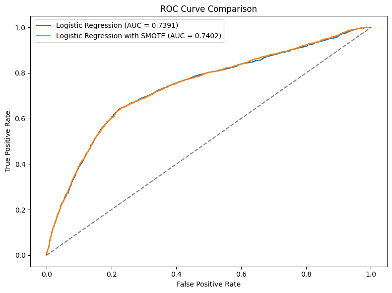
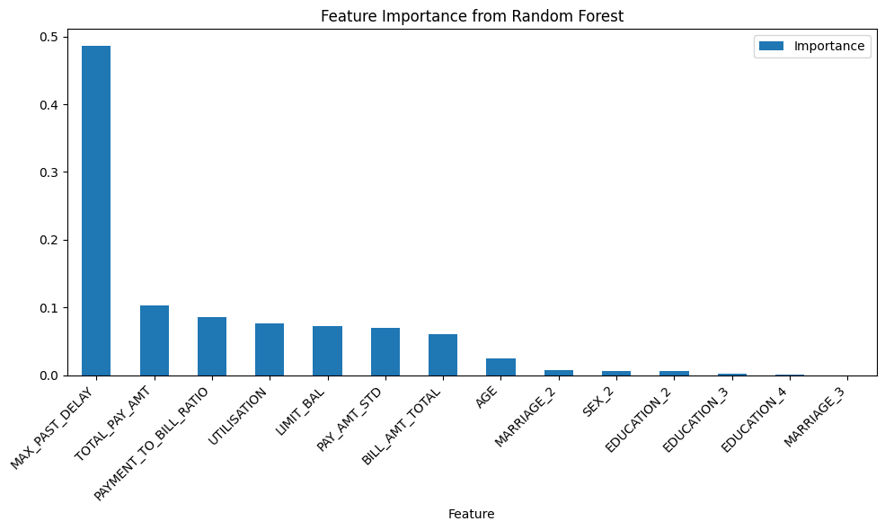
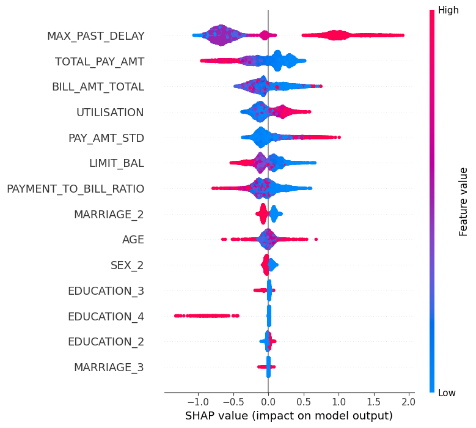

# Credit Card Default Prediction

## Project Overview

This project develops and compares statistical and machine-learning models to predict credit card payment default, using a real-world dataset of Taiwanese credit card customers. The objective is not only to achieve strong predictive performance, but also to identify and explain the key drivers of default risk through interpretable modelling and model-agnostic explanation techniques. Such models are commonly used in credit risk analysis and financial decision-support settings.

The workflow follows a structured data science pipeline:
- data cleaning and validation  
- exploratory data analysis (EDA)  
- baseline interpretable modelling  
- non-linear model comparison  
- global model interpretation  

Models evaluated include **Logistic Regression**, **Random Forest**, and **XGBoost**, with performance assessed using **ROC–AUC** to account for class imbalance. Model explanations are provided using feature importance and SHAP values, enabling insights into how repayment behaviour, credit utilisation, and delinquency history influence default risk.

---

## Dataset

The dataset is sourced from the UCI Machine Learning Repository and originates from a study of credit card payment default using data from major card-issuing banks in Taiwan (2005). It contains records for 30,000 credit card clients, including demographic characteristics, credit limits, billing amounts, repayment behaviour, and historical repayment status.

### Target Variable
- **DEFAULT**: binary indicator of whether a customer defaulted on their credit card payment in the following month.

### Feature Overview
Features are grouped conceptually rather than documented individually:
- **Demographics**: age, sex, education level, marital status  
- **Credit exposure**: credit limit and billed amounts  
- **Repayment behaviour**: repayment amounts, payment-to-bill ratios, and payment variability  
- **Delinquency history**: monthly repayment status indicators capturing past payment delays  

### Data Considerations

- Certain repayment status values are undocumented in the original description; these were retained based on empirical behaviour and consistency with non-delinquent states.
- Negative billing amounts were preserved, as they represent refunds or credit adjustments.
- No observations were removed during cleaning to avoid altering the underlying class distribution.
- Feature engineering was applied to summarise temporal repayment behaviour (e.g. maximum past delinquency and payment volatility).

---

## Methodology

The project follows a structured and reproducible workflow, with each stage implemented in a dedicated notebook.

### Data Cleaning and Validation

Raw data were inspected for structural inconsistencies, undocumented categorical values, and potential data-quality issues that could bias downstream analysis. 

Undocumented repayment status values were examined empirically and kept where their behaviour was consistent with non-delinquent states (near-zero balances and low default probability).

The EDUCATION variable includes undocumented categorical levels (0, 5, and 6) that are not defined in the original documentation. These levels were grouped into an “Other” category to maintain interpretability and avoid introducing arbitrary assumptions

Negative billing amounts were preserved, as they reflect refunds or credit adjustments rather than data errors.

All observations were retained to avoid distorting the original class distribution.

### Exploratory Data Analysis (EDA)

Exploratory analysis focused on identifying which aspects of customer behaviour and financial exposure are most strongly associated with payment default.

**Recent repayment status** (PAY_0) exhibits the **strongest** relationship with default probability. Default rates increase sharply as repayment status deteriorates, indicating that even short-term delinquency is a powerful signal of near-term default risk. Older repayment status variables (PAY_2 to PAY_6) show similar but progressively weaker patterns, suggesting that recency of delinquency is more informative than historical delinquency alone.

Credit limit shows a clear **inverse** relationship with default: customers with **lower credit limits** experience substantially **higher default rates**, while default probability decreases monotonically as credit limits increase. This supports the interpretation that credit limit captures underlying financial capacity and risk tolerance assessed by the issuing bank.

Repayment amount variables display a **strong but non-linear** relationship with default. Customers making very small or highly variable repayments are disproportionately represented among defaulters, while higher and more consistent repayment behaviour is associated with lower risk. Repayment and billing amounts are highly **right-skewed**, reinforcing that normality assumptions are inappropriate. Also, class imbalance for target variable (DEFAULT) means metrics such as ROC-AUC is preferred.

Demographic variables such as age, sex, education, and marital status show comparatively **weak and non-monotonic** relationships with default once behavioural variables are considered. Correlation analysis further confirms that.

Overall, EDA results indicate that **recent delinquency**, **repayment stability**, and **credit exposure** are the primary drivers of short-term default risk. These findings directly motivated the subsequent feature engineering and modelling strategy.

### Feature Engineering

Feature engineering was guided by EDA findings and credit-risk domain considerations.
The EDA showed that raw monthly billing, repayment, and delinquency variables are highly correlated across time and noisy at the individual-month level. 
To preserve signal while reducing redundancy and multicollinearity, temporal information was summarised into compact behavioural indicators

Key engineered features include:

- **MAX_PAST_DELAY** (severity of delinquency):  
  The maximum value across PAY_0–PAY_6 captures the worst observed repayment delay, identified in EDA as the strongest default risk signal

- **BILL_AMT_TOTAL** (overall exposure / utilisation proxy):  
  represents overall outstanding exposure; negative values were retained as they reflect refunds or credit adjustments.

- **TOTAL_PAY_AMT** (repayment effort):  
  summarises overall repayment effort across billing cycles; higher repayment effort is generally associated with lower default risk

- **PAYMENT_TO_BILL_RATIO** (repayment discipline):  
  normalises repayment relative to exposure (total billing), capturing repayment discipline on a comparable scale across customers.

- **UTILISATION** (credit pressure):  
  measures credit pressure as billed balance relative to credit limit; higher utilisation is associated with increased default risk

- **PAY_AMT_STD** (repayment stability):  
  The standard deviation of monthly repayment amounts captures instability in repayment behaviour, reflecting EDA findings that irregular payments are linked to elevated risk.

Automated feature selection (e.g. RFECV) was not applied, as financial variables are correlated by construction and aggressive selection can reduce stability and interpretability. Features were instead retained based on EDA evidence, domain relevance, and consistency across models.

--- 
### Modelling Strategy

Three modelling approaches were evaluated:
- **Logistic Regression** as an interpretable baseline  
- **Random Forest** to capture non-linear relationships and feature interactions  
- **XGBoost** as a gradient-boosted tree model for comparison  

Categorical variables were one-hot encoded. Numerical variables were standardised for logistic regression to ensure stable optimisation and comparable coefficients, while tree-based models were trained on unscaled features, as they are scale-invariant. Class imbalance was addressed through evaluation metrics rather than aggressive resampling.

---

## Model Evaluation and Interpretation

Model performance was evaluated using ROC–AUC, which measures a model’s ability to discriminate between defaulters and non-defaulters across classification thresholds and is robust to class imbalance.

A baseline Logistic Regression model was fitted first to establish an interpretable benchmark. L2 regularisation was used as a stable default to reduce variance and handle correlated financial variables (e.g., billing and repayment aggregates). L2 shrinks coefficients smoothly without performing hard feature selection, which keeps the baseline model interpretable while improving generalisation. Because default events are less frequent than non-defaults, class imbalance was explicitly considered. A SMOTE-augmented logistic regression was evaluated as an alternative imbalance-handling strategy, followed by tree-based models to capture non-linearities and interactions.

Confusion matrices for the baseline model at different probability thresholds illustrate the trade-off between recall and precision in credit risk decisions. Lower thresholds prioritise identifying defaulters at the cost of higher false positives, while higher thresholds reduce false positives but miss a larger proportion of defaulters. This demonstrates that operational outcomes depend on threshold selection rather than changes in model ranking performance.

### Class Imbalance: SMOTE vs Baseline

SMOTE was tested to assess whether synthetic oversampling improves discrimination for the logistic regression baseline. Performance differences were negligible, indicating that oversampling does not materially improve ranking performance in this setting.

### Performance Comparison (Test ROC–AUC)

| Model | ROC–AUC |
|------|---------|
| Logistic Regression | 0.739 |
| Logistic Regression + SMOTE | 0.740 |
| Random Forest | 0.771 |
| XGBoost | 0.773 |

Tree-based models substantially outperform the linear baseline, suggesting meaningful non-linear effects and interactions in default risk. The marginal improvement of XGBoost over Random Forest implies that most predictive structure is already captured by tree-based models, and that further gains are limited by the information content of the dataset rather than model complexity.

---

Interpretability was addressed at multiple levels to ensure transparency and consistency of insights across modelling approaches.
Among the evaluated models, XGBoost achieved the highest ROC–AUC and was therefore selected for detailed model interpretation using SHAP.

### Random Forest Feature Importance

Random Forest feature importance highlights which variables were most frequently used by the model to split the data:

Repayment behaviour and delinquency history dominate model decisions. Maximum past delinquency is the most influential feature, followed by repayment-related measures such as total repayment amount, payment-to-bill ratio, utilisation, and payment variability. Demographic variables contribute minimally once behavioural and financial features are included. Due to correlations among financial variables, importance values are interpreted qualitatively rather than as precise rankings.

### XGBoost model hyperparameters

Hyperparameters were chosen to balance capacity and overfitting risk: a moderate tree depth (max_depth=4) limits overly complex interactions; a smaller learning rate (0.05) with more trees (n_estimators=300) improves incremental learning stability; subsample=0.8 and colsample_bytree=0.8 add randomness to reduce overfitting and improve robustness. 

### SHAP Analysis (XGBoost)

To provide a detailed global explanation of the best-performing model (XGBoost), SHAP values were used:

The SHAP summary plot confirms that default risk is primarily driven by repayment behaviour and delinquency severity. Higher past delinquency, unstable repayment patterns, higher utilisation, and lower repayment effort increase predicted default risk, while higher repayment ratios and larger credit limits reduce risk. Demographic variables show limited impact once behavioural factors are accounted for.

Across models (logistic regression, Random Forest, and XGBoost) and explanation methods (SHAP), results are consistent: behavioural repayment signals dominate default risk and are substantially more informative than demographic attributes for short-term credit risk assessment.

---

## Limitations

Model performance plateaus at approximately ROC–AUC ≈ 0.77 across tree-based methods, suggesting that predictive power is constrained by the information content of the available features rather than model complexity. As a result, outputs should be interpreted as relative risk estimates rather than precise default probabilities.

---

## Repository Structure and Reproducibility

Each stage of this project is implemented in a separate notebook, following the logical progression from data preparation to modelling and interpretation.

### Structure
- `notebooks/`: Jupyter notebooks implementing data cleaning, EDA, modelling, and interpretation  
- `data/processed/`: cleaned and feature-engineered dataset used for modelling  
- `models/`: saved model pipelines and metadata  
- `reports/figures/`: figures used in this README 

### Reproducibility
All dependencies are listed in `requirements.txt`. After installing the required packages, the analysis can be reproduced by running the notebooks in numerical order, from data cleaning through to model interpretation.
Saved model pipelines are provided to allow reuse without retraining.

